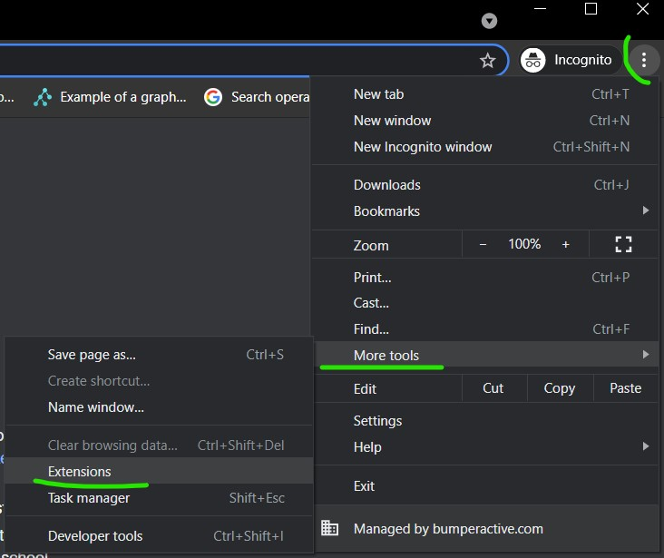
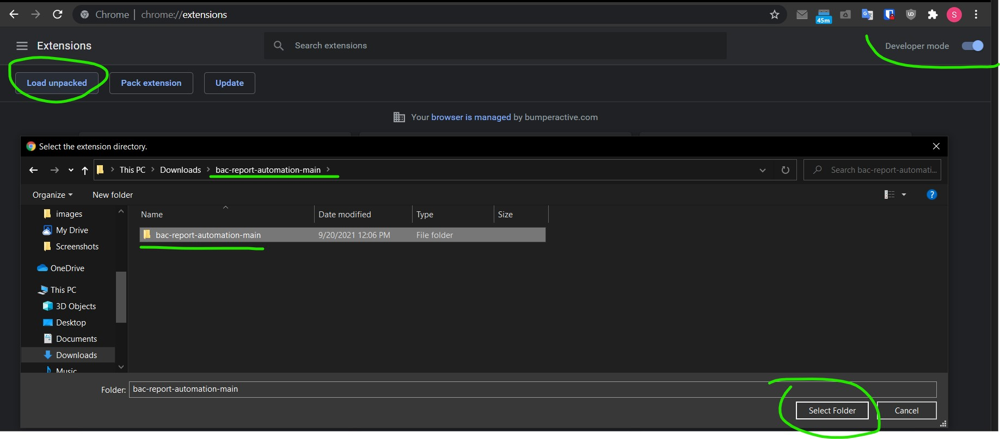
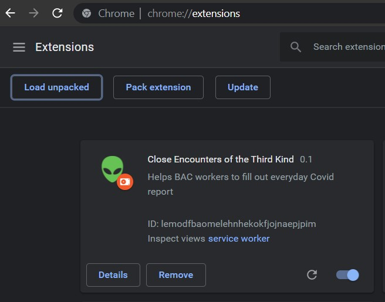
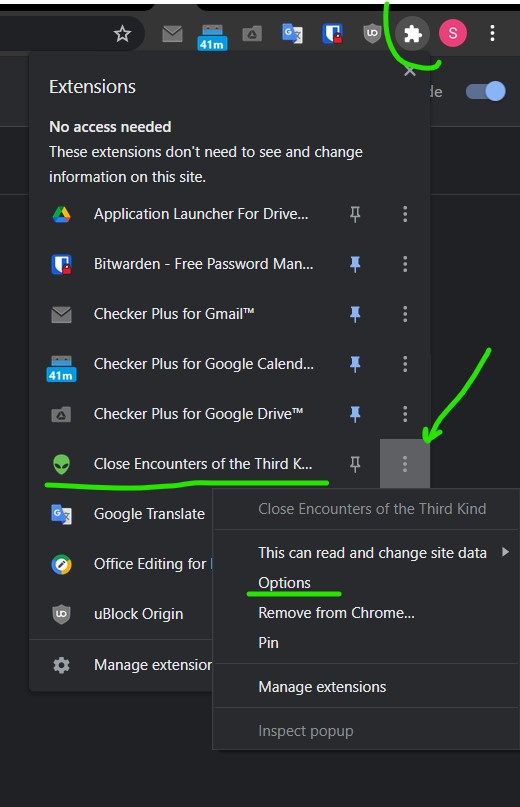
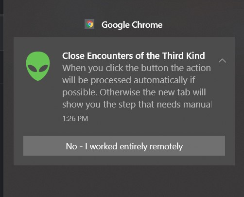

# Close Encounters of the Third Kind
Google Chrome extensions that helps to fill BAC everyday co-worker contact report.

The extension remembers your name and shows you a system notification at selected time. 
On the button click it either fills and send the form automatically (if you didn't meet anyone) or leads you to the co-worker selection page.

v 0.1 features:

- Allows you to select days of the week and a certain time when to show a notification
- Default action option either fills the form and send it automatically if you worked remotely OR leads you to the page that needs user's manual actions (page with co-workers checkobxes)
- Play sound option allows sound alarm when the notification showed. Playing sound is a pretty brittle feature and may not work depends on the runtime context (if your current active browser tab is playable etc.)

TODO:

- Add non-default action choice for cases when you work on site and remote during the week
- Add a "co-workers checkboxes pre-fill" button to simplify checkboxes list population. It should keep your last choice of co-workers on every submit.
- Fix: make sure it executes the code only once on onUpdate event
- Add onRemove listener and clen up after yourself
- Fix: move from unreliable timeouts to MutationObserver

## Installation instructions

1. Download ZIP from here https://github.com/srgpsk/bac-report-automation/archive/refs/heads/main.zip and unpack.

2. Go to the extensions page

3. Enable Developer mode on the right and select Load unpacked. In **Load unpacked** dialog window go to your **Downloads** folder and select a *bac-report-automation-main* folder inside *bac-report-automation-main*, click *Select folder*

4. As a result, you should see the new extension appears on the Extensions page

5. Now, when the extension is installed, it's time to set the user options. Go to the extension options page

6. And set 2 required options - your name and an action that will be used by default when you click on the notification window button later. You can also adjust other optional parameters to reflect your needs.

7. The system notification pop-up will show up near the time you set in options (Chrome may delay it a little)
   

8. Click to the button will either fill and send the form for you or lead you to the co-workers list page for manual action.
